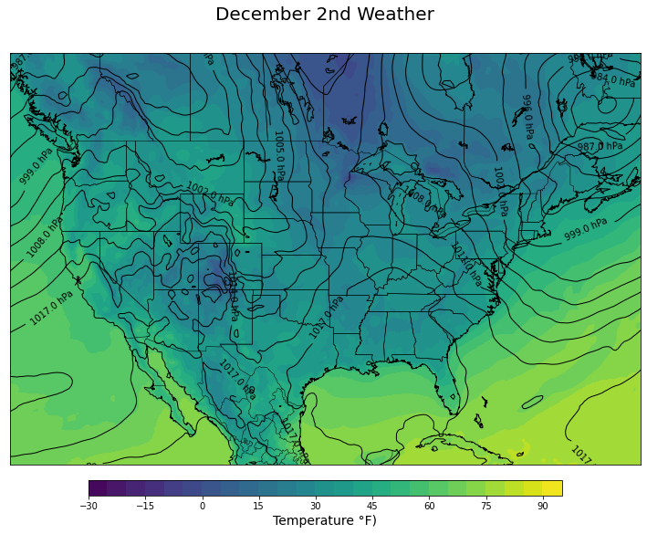

# Examining the Weather on Your Date of Birth

This Jupyter notebook is a simple example of how to work with the [ERA5 Zarr data](https://registry.opendata.aws/ecmwf-era5/) available on the [Registry of Open Data on AWS](https://registry.opendata.aws).

Data stored and accessed via the [Zarr](https://github.com/zarr-developers/zarr-python) package can be worked with directly from Amazon S3. This means you do not first need to download the data and can instead access it directly in your code while loading the data into memory when it is required. Another advantage of Zarr is that you can subset the data before you request it so you only access from Amazon S3 the data that you need for your calculation.

The [ECMWF ERA5 Zarr data](https://registry.opendata.aws/ecmwf-era5/) is managed by intertrust.com and made available in both NetCDF and ZARR formats. The data currently covers the globe with hourly resolution from 1979 through present with a slight delay on the most recent data. Available variables include air pressure at mean sea level, air temperature at 2 metres, air temperature at 2 metres 1hour Maximum, air temperature at 2 metres 1hour Minimum, dew point temperature at 2 metres, eastward wind at 100 metres, eastward wind at 10 metres, integral wrt time of surface direct downwelling shortwave flux in air 1hour Accumulation, lwe thickness of surface snow amount, northward wind at 100 metres, northward wind at 10 metres, precipitation amount 1hour Accumulation, sea surface temperature, snow density, and surface air pressure.

Now what was the weather like on the day I was born? Cold, with a cold front having pushed through a Canadian air mass but with little precipitation.



## Working with this notebook using Docker

This repository contains a Dockerfile for reproducing the environment for the Jupyter notebook.

Build the Docker image:

```
docker build -t weather .
```

Run the Docker container pointing to a local volume to save notebook changes:

```
docker run -p 8888:8888 -v `pwd`/notebooks:/notebooks --rm -ti weather
```

and then navigate to [http://localhost:8888](http://localhost:8888) in your browser to find the Jupyter notebook.
